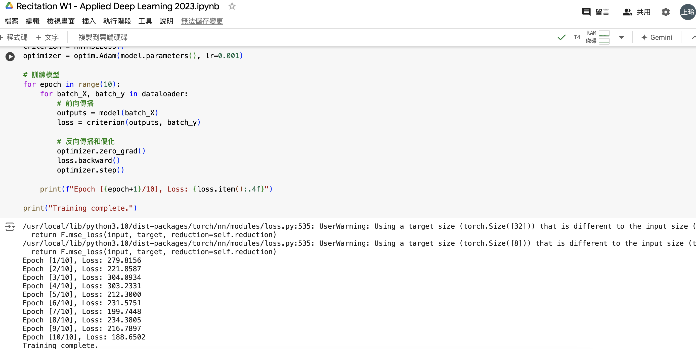

# LLM-Homework

## Week 6: Learn Basic PyTorch



## Week 7-1: LoRA

```python
!pip install peft
from peft import LoraConfig, TaskType, get_peft_model, IA3Config
```
### Config
```python
peft_config = LoraConfig(
    lora_alpha=16,
    lora_dropout=0.1,
    r=64,
    bias="none",
    task_type="SEQ_CLS",
    target_modules=["q_lin", "k_lin", "v_lin", "out_lin"],
)
```
<div></div>

### Config_2
```python
peft_config_2 = LoraConfig(
    lora_alpha=32,
    lora_dropout=0.05,
    r=128,
    bias="none",
    task_type="SEQ_CLS",
    target_modules=["q_lin", "k_lin", "v_lin", "out_lin", "ffn.lin1", "ffn.lin2"],
)
```
<div></div>

### Config_3
```python
peft_config_3 = LoraConfig(
    lora_alpha=16,
    lora_dropout=0.1,
    r=64,
    bias="none",
    task_type="SEQ_CLS",
    target_modules=["q_lin", "v_lin", "ffn.lin1"],
)
```
<div></div>

### Config_IA3
```python
peft_config_IA3 = IA3Config(
    task_type=TaskType.SEQ_CLS,
    target_modules=["q_lin", "v_lin", "k_lin", "out_lin", "ffn.lin1", "ffn.lin2"],
    feedforward_modules=["ffn.lin1", "ffn.lin2"],
)
```
<div></div>

## Week 7-2: LaTeX

For details, please refer to the [mvc\_week7.pdf](mvc_week7.pdf) file.


<div align="center"></div>


